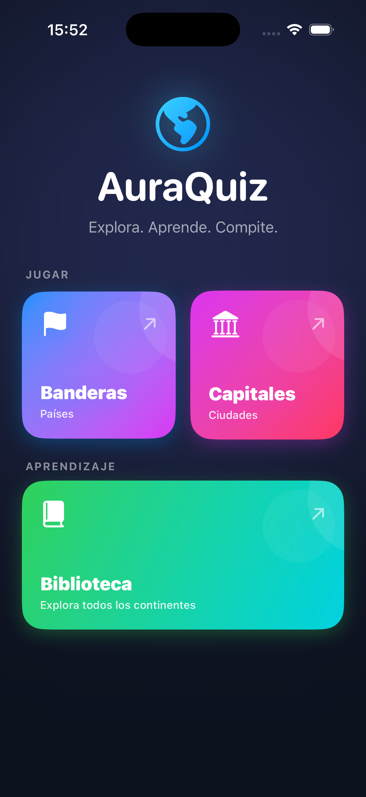

# AuraQuiz 🌍✨

**Desafío global de banderas y capitales mundiales**

AuraQuiz es una aplicación multiplataforma diseñada con **SwiftUI** que pone a prueba tus conocimientos de geografía. Desafía tu mente identificando banderas y capitales de todo el mundo a través de una interfaz moderna con estética neón.

## 🚀 Características
* **Modos de Juego:** Banderas y Capitales.
* **Niveles de Dificultad:** Fácil, Medio y Difícil.
* **Multiplataforma:** Optimizado para iOS, macOS y visionOS.
* **Biblioteca de Estudio:** Países organizados por continentes.

---

## 📸 Capturas de Pantalla

### 🖥️ Pantallas de Inicio
| Mac (Inicio) | iPhone (Inicio) |
| :---: | :---: |
|  |  |

### ⚙️ Configuración y Reto
| Selección de Dificultad | Biblioteca de Estudio |
| :---: | :---: |
|  |  |

### 🎮 Gameplay (iPhone)
| Modo Banderas | Modo Capitales |
| :---: | :---: |
|  |  |

---

## 🛠️ Tecnologías utilizadas
* **Lenguaje:** Swift 5.0.
* **Framework:** SwiftUI.
* **Arquitectura:** MVVM con `@Observable`.
* **API:** [RestCountries API](https://restcountries.com/).

## 📥 Instalación
1. Clona este repositorio.
2. Abre `AuraQuiz.xcodeproj` en Xcode 16+.
3. Selecciona tu dispositivo y pulsa **Run (⌘R)**.

---
Desarrollado con ❤️ por **José Manuel Jiménez**
